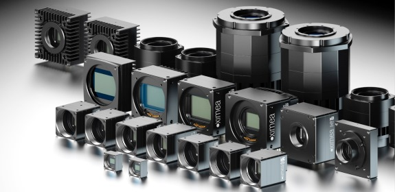

.. _camera-ximea:

Ximea
-------



Intoduction
```````````
Ximea is a manufacturer of an extremely diversified and highly modular camera family. It offers multiple choices of combining sensors and interfaces. Together with minimal latencies and CPU load, the cameras are a perfect fit for embedded vision and multi-camera applications. Thanks to flat flex cabling, the board-level and semi-housed variants allow integration in tight spaces and close proximity between cameras.

The plugin described here aims to provide full Ximea camera functionality for Lima.

Installation & Module configuration
````````````````````````````````````

Follow the generic instructions in :ref:`build_installation`. If using CMake directly, add the following flag:

.. code-block:: sh

 -DLIMACAMERA_XIMEA=true

For the Tango server installation, refers to :ref:`tango_installation`.

Prerequisites
``````````````

In order to use the Ximea plugin, Ximea Linux Software Package needs to be installed on the target machine. The package can be downloaded from the Ximea website (https://www.ximea.com/support/documents/4).
The installation process is pretty straightforward:

.. code-block:: sh

 tar xvzf XIMEA_Linux_SP.tgz
 cd package
 ./install -pcie

Use the ``-pcie`` option to install with support for PCI Express cameras, if this is not needed you can just run ``./install``.

**Important notes**:

- Software Package versions ``4.21.24``, ``4.21.26`` and ``4.21.30`` have compability problems when running on Ubuntu 20.04. It is however advised to always use the newest version of the Software Package, which at the time of writing is ``4.23.02``.
- The XIMEA kernel module is not DKMS-enabled, which means it needs to be recompiled if a new kernel is installed. In general, running the ``./install`` command again should be sufficient. In case of problems, try to recompile the module manually (example for PCIe cameras):

.. code-block:: sh
 
 cd /opt/XIMEA/src/ximea_cam_pcie
 make clean
 make PWD=$(pwd)
 make install PWD=$(pwd)
 insmod ximea_cam_pcie.ko

If further clarification is needed please refer to the Software Package's ``README`` file.

Initialisation and Capabilities
````````````````````````````````

Implementing a new plugin for new detector is driven by the LIMA framework but the developer has some freedoms to choose which standard and specific features will be made available. This section is supposed to give you the correct information regarding how the camera is exported within the LIMA framework.

Camera initialisation
......................

The camera will be initialized within the :cpp:class:`Ximea::Camera` class. Camera contructor aims to start up the camera and load default startup configuration.

There are so many hardware parameters you can set, but refer to the Ximea documentation for a good practice.

Std capabilites
................

This plugin has been implemented in respect of the mandatory capabilites but with some limitations which are due to the camera. We only provide here extra information for a better understanding of the capabilities for Ximea cameras.

* HwDetInfo

  getPixelSize(): Will always return 10um x 10um pixel size for unknown cameras. (The only camera known at the moment is MX377MR which pixel size is also 10um x 10um)

* HwSync

  get/setTrigMode():  supported modes are IntTrig, IntTrigMult and ExtTrigMult.

Optional capabilites
........................
In addition to the standard capabilities, we make the choice to implement some optional capabilities which
are supported by this detector. A Shutter control.

* HwBin

  Supported modes: 1x1, 2x2, 4x4

* HwRoi
* HwEvent

How to use
````````````

This is a python code example of a simple acquisition:

.. code-block:: python

  import time
  from Lima import Core, Ximea

  cam = Ximea.Camera(0)
  hw = Ximea.Interface(cam)
  ct = Core.CtControl(hw)

  # configure saving
  sav = ct.saving()
  sav.setSavingMode(Core.CtSaving.AutoFrame)
  sav.setFormat(Core.CtSaving.EDF)
  sav.setPrefix('test')
  sav.setOverwritePolicy(Core.CtSaving.Overwrite)
  sav.setDirectory('/tmp')

  # set configuration, see documentation for details
  ct.image().setBin(Core.Bin(2, 2))

  ct.prepareAcq()
  ct.startAcq()

  while ct.getStatus().AcquisitionStatus != Core.AcqReady:
      time.sleep(0.1)

  img = ct.ReadBaseImage(0)
